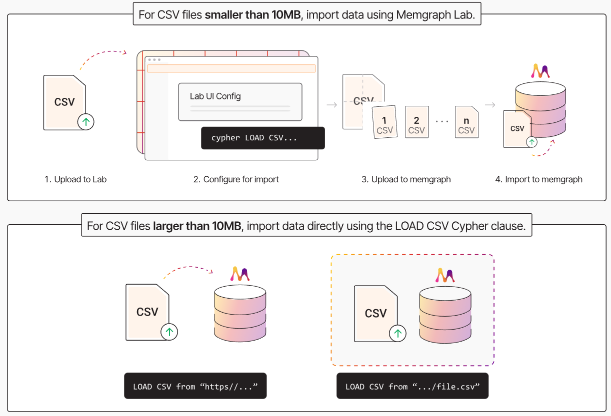
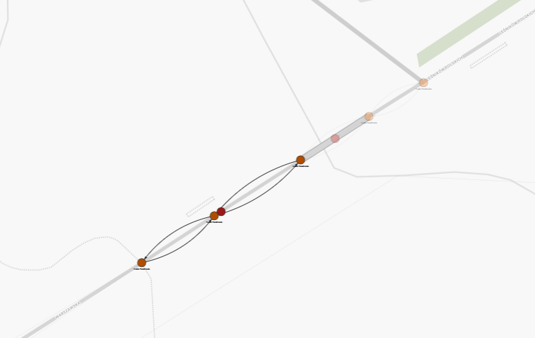

# Advanced Database Systems
Paulina Gacek, Jakub Hulek

# Milestone 1: Choice of technologies, model & definitions (and partially Milestone 2)
## Main Technology
Memgraph [link](https://memgraph.com/)

According to Memgraph documentation, nodes are stored in a skip list, a dynamic data structure that organizes nodes by their internal IDs.

### Additional Technologies
Python with Geopandas and Neo4j Libraries

## Architecture Overview

Memgraph provides Docker images containing the database and a GUI system for interacting with the database.   
We will combine this with our own custom Docker container that will manage the database and implement a CLI tool for querying the database.  
These containers will be managed with Docker Compose.  

**Summarized Containers:**  
1. **Custom Manager** Container
2. Memgraph Container (Database and Memgraph's Algorithms)  
3. Memgraph Frontend (Optional, for Visualizations)  

## Installation 

### Requirements
Docker with Docker Compose installed on the host OS

### Deployment instructions

```bash
docker compose up --build
```

Recommended adding this line into file /etc/sysctl.conf
```
vm.max_map_count = 262144  
```

## General Data Flow
Upon startup, the **Manager** container will import data from CSV files present in the project's directory. This process will be conducted using Python with Neo4j.  
The **Manager** will implement and provide a CLI tool for querying the database. If Memgraph is unable to fully process a query, we will use Geopandas to patch any gaps.  


 
### Parallelism Detection
Two roads are considered parallel if and only if there exists one segment from each road that is parallel to one another.  
Two road segments are considered parallel if and only if:  
1. The minimal distance between the two ending points of the two segments is smaller than $x$.  
2. The angle between the two vectors describing the segments is smaller than $\alpha$.  

$x$ and $\alpha$ are parameters of query number 6.  


## Geometry storage
### Point indexes
According to the [documentation on point indexes](https://memgraph.com/docs/fundamentals/indexes#point-index) :
```
Point index can be utilized for more performant spatial queries which use WHERE point.distance() or WHERE point.withinbbox().
```
### Point data type
According to the [documentation on point data type](https://memgraph.com/docs/fundamentals/data-types#:~:text=client%2Dside%20results.-,Point,-Point%20is%20a) :
```
Point is a spatial data type consisting of 2D or 3D locations in the Cartesian or WGS84 system. The coordinates of the location are stored as a 64-bit Float numbers. Each point type has an associated coordinate reference system (CRS) and a spatial reference identifier (SRID). Points can be created with the point function. For fast queries, points can leverage the point index.
```

### Usage examples
```cypher
MATCH (n) DELETE n;
CREATE (l:City {name:'London', geometry:point({longitude: 51.51, latitude: -0.12})});
CREATE (l:City {name:'Zagreb', geometry:point({longitude: 45.82, latitude: 15.97})});  
  
MATCH (c1:City),(c2:City)
RETURN c1.name, c2.name, point.distance(c1.geometry, c2.geometry) AS result;

MATCH (n) DELETE n;
CREATE (l:City {name:'London', geometry:point({x:3622779.924618, y:3200649.292915})});
CREATE (l:City {name:'Zagreb', geometry:point({x:4788657.089249, y:2542917.922569})});
MATCH (c1:City),(c2:City)
RETURN c1.name, c2.name, point.distance(c1.geometry, c2.geometry) AS result;

MATCH (n) DELETE n;
CREATE (l:City {name:'London', geometry:[point({x:3622779.924618, y:3200649.292915}), point({x:3622779.924618, y:3200649.292915})]});
MATCH (n) RETURN n.geometry;
```
**Notes:**
- Minimal geospatial capabilities  
- Geometry point as point type property  
- Complex points as list of points  

# Milestone 2: Data model & environment design (the rest)
## Importing data
- 17 424 648 - number of buildings  
- 14 698 410 - number of road nodes  
- 2 588 734 - number of roads  
- 1 121 912 - number of trees  
- 130 389 - number of railways   
- Others negligible  
- Totaling around 36 milion nodes  
- Guessing their will be 100-200 milion relationships
  
*Memgraph page suggests that they can create 1 million nodes/relatioship per second assuming optimized import.*  
### Modelling 
- building - nodes  
- cities - nodes  
- communes - nodes  
- countries - nodes  
- powiats - nodes  
- railways - nodes connected with relationships  
- roads - separted into multiple nodes connected with relationships to each other + relationship to road metadata  
- trees - nodes  
- voivodships - nodes    
 
**Example from memgraph:**
```python
target_nodes_directory = Path(__file__).parents[3].joinpath(f"datasets/graph500/{size}/csv_node_chunks")
for file in target_nodes_directory.glob("*.csv"):
    subprocess.run(["docker", "cp", str(file), f"memgraph:/usr/lib/memgraph/{file.name}"], check=True)
 
queries = []
for file in target_nodes_directory.glob("*.csv"):
    queries.append(f"LOAD CSV FROM '/usr/lib/memgraph/{file.name}' WITH HEADER AS row CREATE (n:Node {{id: row.id}})")
```

## Modelling capabilites
1. Cities which are within commune boundaries 
   - precomputed with geopandas, 
   - city - commune relationship
2. Communes which are within powiat boundaries 
   - precomputed with geopandas, 
   - commune - powiat relationship
3. Powiats which are within voivodship boundaries 
   - precomputed with geopandas, 
   - powiat - voivodship relationship
4. Voivodship which are within country boundaries 
   - precomputed with geopandas, 
   - voivodship - country relationship
5. Neighbouring (adjacent) communes 
   - precomputed with geopandas, 
   - commune - commune relationship
6. All neighbouring buildings not further than 500 meters apart; 
   - attributes: distance(meters) 
   - center of a building precomputed with geopandas, then relationship either precomputed or used memgrpahs point index for faster querying
7. All neighbouring trees not further than 50 meters apart; 
   - attributes: distance (meters) 
   - relationship either precomputed or used memgrpahs point index for faster querying
8. Trees which are not further than 20 meters from a road 
   - precomputed with geopandas, 
   - tree - road relationship 
9.  Roads which are connected through nodes; 
    - attributes: connecting node identifier, which part of one road is connected to the other road (start, mid, end)
    - precomputed with geopandas, 
    - road - road relationship
10. Railways which cross roads; 
    - attributes: angle 
    - precomputed with geopandas, 
    - railway - road relationship

# Milestone 3: Data import
## Data Import using CLI
To interact with the manager CLI run  
```bash
docker compose run --rm manager
```
And follow the instructions   

### Import pipeline  
1. User enters "import trees" into the CLI  
2. Manager splits every file over 1 milion rows into multiple 1 milion rows files  
3. For each csv chunk there is a process created that sends query to the memgraph  

F. e. trees take 10.5 seconds to preprocess and split the csv file, memgraph takes 6 seconds to create all of the nodes  

## Which distance calculation is faster
Import query  
```cypher
LOAD CSV FROM '/data/trees/chunk_1.csv' WITH HEADER AS row 
CREATE (n:Node {
      id: row.id,
      geometry_earth:point({longitude: toFloat(row.long), latitude: toFloat(row.lat)}),
      geometry_poland:point({x: toFloat(row.x), y: toFloat(row.y)}) 
})
```

```
MATCH (n1:Node), (n2:Node)
WHERE n1 != n2
RETURN  n1.id, n2.id, point.distance(n1.geometry_earth, n2.geometry_earth) AS distance
LIMIT 1000000;
```
This query took 4.85s frontend roundtrip, database execution 1.34s  
This query took 4.93s frontend roundtrip, database execution 1.21s  
This query took 4.96s frontend roundtrip, database execution 1.22s  
 
```
MATCH (n1:Node), (n2:Node)
WHERE n1 != n2
RETURN  n1.id, n2.id, point.distance(n1.geometry_poland, n2.geometry_poland) AS distance
LIMIT 1000000;
```
This query took 4.97s frontend roundtrip, database execution 1.16s  
This query took 4.98s frontend roundtrip, database execution 1.16s  
This query took 4.92s frontend roundtrip, database execution 1.18s  

Cartesian calculations take 6% less time.   

## Built-in visualisation


For memgraph-lab to visualise points on the map, nodes have to have properties "lat" and "lng".  

### Powiats


## Import report (only memgraph)
This does not include preprocessing and fragmenting dataframes
```
Import Report:
Buildings data imported in 26.43 seconds.
Cities data imported in 3.68 seconds.
Communes data imported in 1.70 seconds.
Countries data imported in 0.25 seconds.
Powiats data imported in 0.85 seconds.
Railways data imported in 1.38 seconds.
Roads data imported in 16.80 seconds.
Trees data imported in 3.55 seconds.
Voivodships data imported in 0.36 seconds.
Total time taken: 55.00 seconds.
```


## Import report (entire pipeline)
```
Import Report:
Buildings data imported in 589.91 seconds.
Cities data imported in 17.28 seconds.
Communes data imported in 7.64 seconds.
Countries data imported in 0.57 seconds.
Powiats data imported in 3.54 seconds.
Railways data imported in 6.54 seconds.
Roads data imported in 402.41 seconds.
Trees data imported in 13.97 seconds.
Voivodships data imported in 1.15 seconds.
Total time taken: 1043.01 seconds.
```

## Results
36 milion nodes - 12.5 GB

### Cities


### Communes


### Voivodships


### Countries


# Milestone 4: Relationship detection

## Creating Relationships with the CLI Tool
Our command-line interface (CLI) simplifies relationship creation. The process involves two main steps:
1. Ensure all required nodes are already imported into the database. If not, use the appropriate import command. For example, to import cities and communes, run: `import auto cities communes`.
2. Create a specific relationship using the cr command followed by the relationship number. For instance, to create the first relationship (Cities within commune boundaries), execute: `cr 1`. 

## Relationship Creation Performance
The following list summarizes the time taken to create various relationships, along with the resulting number of edges and their approximate size:
- Relationship 1: 50.75 seconds (25,741 edges, 987.51 MiB)
- Relationship 2: 12.85 seconds (2,561 edges, 735.38 MiB)
- Relationship 3: 9.10 seconds (413 edges)
- Relationship 4: 3.08 seconds (31 edges)
- Relationship 5: 116.64 seconds (14,308 edges, 685.7 MiB)
- Relationship 6 (truncated to around 3 million) around 3 minutes 20 seconds    
- Relationship 7 created in 19.62 seconds. (32 milion edges, 4GB)   
- Relationship 8 created in 31.68 seconds. (1.3 milion edges)  
- Relationship 9 created in 118.00 seconds. (6 milion edges)
- Relationship 10 created in 134.50 seconds. (60k edges)

## Implementation

### Relationships 1-4
The first four relationships were implemented in a similar manner. They create "IS_LOCATED" relationship between bigger entity and smaller entity.

1. Indexing and Spatial Filtering:
We first created essential indexes (including point indexes) on relevant nodes to facilitate faster lookups.
We then optimized queries to identify candidate nodes for relationship creation. This involved shrinking the search space as much as possible.
For example, in the first relationship, we only retrieved pairs where the city center was located within the bounding box of the corresponding commune. This significantly reduced the number of unnecessary comparisons.

2. Analyzing and Optimizing Queries:
We initially used a simple query that directly matched  City and Commune nodes:
   ```
      MATCH (city:City), (commune:Commune)
   ```
   However, this resulted in a Cartesian product, leading to a large number of comparisons.
   To address this, we used the EXPLAIN command to analyze the query plan and identify potential bottlenecks. Based on the analysis, we implemented a more optimized approach:
   ```
   MATCH (commune:Commune) WITH commune.lower_left_corner as llc, commune.upper_right_corner as urc, commune 
   MATCH (city:City)  
   WHERE point.withinbbox(city.center, llc, urc) 
   RETURN city.id AS city_id, city.center.x AS city_x,
   ```
3. CSV for Temporary Storage and Relationship Creation

   The filtered data from the optimized query was saved to a temporary CSV file.
   This data then served as a source for creating relationships between the corresponding nodes identified in the CSV.

4. Cleanup

   Finally, we cleaned up by deleting the temporary indexes created for efficient execution.
   The first four relationships were implemented analogously. First we created necessary indexes and point indexes. Then we obtained the candidate nodes for creating relationships, ooptimiizng the query and srinking the search space as much as we can. For example, in first relationship we returned only pairs with communes and cities within bounding boxes of these communes.

### Relationship 5

The core idea is to efficiently filter commune pairs before performing computationally expensive adjacency checks. This is achieved through the following steps:

1. First we calculate the maximum diamiter (max_dia) among all communes, which at the same time is the longest possible distance between the centers of 2 communes.
2. Only pairs whose centers are within max_dia of each other are considered potential neighbors. This spatial pre-filtering drastically reduces the number of pairs that need to be checked for actual adjacency.
3. To further optimize, the query enforces a directional comparison using id(c1) < id(c2). This ensures that each commune pair is evaluated only once, preventing redundant calculations.

### Geometric Adjacency Check

A geometric check is performed using the `touches` or `overlaps` functions from a spatial library shapely. This function uses WKT representations of the commune boundaries to determine actual adjacency.

      A and B overlap if they have some but not all points in common, have the same dimension, and the intersection of the interiors of the two geometries has the same dimension as the geometries themselves.

As the result, adjacent communes are connected with the "IS_ADJACENT" relationship to each other (bidirectional relationship).

### Relationship 6
### Relationship 7
### Relationship 8
### Relationship 9
### Relationship 10

## Examples of implemented relationships to be detected
### Relationship 1 - Cities which are within commune boundaries


### Relationship 2 - Communes which are within powiat boundaries


### Relationship 3 - Powiats which are within voivodship boundaries


### Relationship 4 - Voivodship which are within country boundaries


### Relationship 5 - Neighbouring (adjacent) communes


Gmina Biskupice borders with only 3 other communes, which was correctly detected by our system, and presented in the below screenshot:

Gmina miejsko-wiejska Pisz (the Pisz urban-rural commune) borders the following communes: Rozogi, Ruciane-Nida, Mikołajki, Orzysz, Biała Piska, and also Kolno, Łyse, and Turośl in the Podlaskie Voivodeship. Which was correctly detected by our system, and presented in the below screenshot:


### Relationship 6 - All neighbouring buildings not further than 500 meters apart;
  

### Relationship 7 - All neighbouring trees not further than 50 meters apart


### Relationship 8 - Trees which are not further than 20 meters from a road


### Relationship 9 - Roads which are connected through nodes; attributes


### Relationship 10 - Railways which cross roads; attributes:


## Performance and Storage problems
### Memory Limitations
During development, we encountered numerous memory-related crashes. The solution was to increase the allocated RAM and swap for WSL2.

### On-Disk Transaction Considerations
The next issue was that on disk transactional did not work.
While this could be revisited in the future, our primary focus during this stage was on modeling relationships.

### Potential Future Issues
In the future problems may come up again or computations may slow down significantly.

### Possible solutions (?)
- gqlalchemy (link: https://memgraph.com/blog/gqlalchemy-on-disk-storage)
- additional database for storing

### Road Connections
  

### Problems with point index
  

### Performance Evaluation and Scalability Analysis
#### Creating buildings neighbourhood problem
We conducted a performance evaluation of relationship creation. Processing approximately 10 000 building nodes took 3 minutes and resulted in over 3 milion relationships. 
For example, the top red building in the below picture has over 300 relationships and this is a sh*t hole in the Podkarpackie voivodship.

  

#### Extrapolation to Full Dataset
Extrapolating these results to the full dataset of 17 million building nodes suggests the following:
- Processing all 17 million nodes would require an estimated 5100 minutes (85 hours), assuming a similar distribution of relationships.
- This would result in approximately 5.1 billion relationships.

##### Performance Bottlenecks
We explored several optimization strategies to improve performance, including:  
- `export_util` was checked for speed, did not work.   
- Multiple versions of parallelizations were checked, did not work.  

#### Resource Consumption:
Creating the initial 3 million relationships consumed 24.26 seconds and approximately 1GB of memory. Extrapolating this to the full dataset:
Creating 5.1 billion relationships (1,700 times more than the initial test) would require an estimated 1.7TB of memory, assuming a similar relationship distribution.  

1. A 500-meter radius around a single point (approximating a building as a point in this initial calculation) covers an area of 78.54 hectares (ha).
2. Poland has an area of approximately 311,888 square kilometers (km²), which is equivalent to 31,188,800 ha. With 17 million buildings, this translates to an average of one building per 1.8 ha, assuming a uniform distribution across the country.
3. Based on this uniform distribution, each building would, on average, have approximately 43 other buildings within its 500-meter radius (78.54 ha / 1.8 ha ≈ 43.6).
4. If we consider non-directional relationships (i.e., if building A is within 500m of building B, the relationship is only counted once), the total number of relationships would be significantly reduced. With 17 million buildings and an average of 43 relationships per building, the total number of non-directional relationships would be approximately (17,000,000 * 43) / 2 = 365,500,000 which is approximately 366 million relationships.
5. 366 mln relationships translates to over 100GB of memory.

##### Impact of Building Dimensions:
The calculation above assumes buildings are point locations. In reality, buildings have dimensions. Considering the distance between the edges of buildings further complicates the analysis and increases the potential number of relationships. This is because two buildings could be slightly further apart than 500m center to center, but still be within 500m edge to edge. This significantly increases the calculation complexity and the number of relationships.
 
#### Scalability Tests with Tree Data
##### Initial Test
Using 1 million trees and a 50-meter radius for relationship creation, we generated 32 million edges (relationships) and consumed 4GB of memory.

##### Extrapolation to 17 Million Trees (Optimal Case):

To estimate the impact of scaling to 17 million trees, we considered an optimal scenario where each additional tree is located in a separate dimension. This minimizes the number of new relationships created as the dataset grows (a highly unrealistic scenario, but useful for establishing a lower bound).

Under this optimal scenario, scaling to 17 million trees would result in:
- Estimated Edges: 544 million edges (32 million * 17).
- Estimated Memory Consumption: 68 GB of memory (4 GB * 17).

# Time it took for each milestone  
Milestone 1: Choice of technologies, model & definitions - 6 hours  
Milestone 2: Data model & environment design - 6 hours  
Milestone 3: Data import - 30 hours  
Milestone 4: Relationship detection - 80 hours

# Resources
1. https://memgraph.com/docs/data-migration/best-practices  
