# Advanced Database Systems
Paulina Gacek, Jakub Hulek

This project was done as a part of Advanced Database Systems course.  
It focues on modelling part of OpenStreetMap data of Poland into a Memgraph graph database.  
Main task was to create an import pipeline and create specified relationships and a tool CLI to query it.  

# Milestone 1: Choice of technologies, model & definitions (and partially Milestone 2)
## Main Technology
Memgraph [link](https://memgraph.com/)

According to Memgraph documentation, nodes are stored in a skip list, a dynamic data structure that organizes nodes by their internal IDs.

### Additional Technologies
Python with Geopandas and Neo4j Libraries

## Architecture Overview

Memgraph provides Docker images containing the database and a GUI system for interacting with the database.   
We will combine this with our own custom Docker container that will manage the database and implement a CLI tool for querying the database.  
These containers will be managed with Docker Compose.  

**Summarized Containers:**  
1. **Custom Manager** Container
2. Memgraph Container (Database and Memgraph's Algorithms)  
3. Memgraph Frontend (Optional, for Visualizations)  

## Installation 

### Requirements
Docker with Docker Compose installed on the host OS

### Deployment instructions

```bash
docker compose up --build
```

Recommended adding this line into file /etc/sysctl.conf
```
vm.max_map_count = 262144  
```

## General Data Flow
Upon startup, the **Manager** container will import data from CSV files present in the project's directory. This process will be conducted using Python with Neo4j.  
The **Manager** will implement and provide a CLI tool for querying the database. If Memgraph is unable to fully process a query, we will use Geopandas to patch any gaps.  

 
### Parallelism Detection
Two roads are considered parallel if and only if there exists one segment from each road that is parallel to one another.  
Two road segments are considered parallel if and only if:  
1. The minimal distance between the two ending points of the two segments is smaller than $x$.  
2. The angle between the two vectors describing the segments is smaller than $\alpha$.  

$x$ and $\alpha$ are parameters of query number 6.  


## Geometry storage
### Point indexes
According to the [documentation on point indexes](https://memgraph.com/docs/fundamentals/indexes#point-index) :
```
Point index can be utilized for more performant spatial queries which use WHERE point.distance() or WHERE point.withinbbox().
```
### Point data type
According to the [documentation on point data type](https://memgraph.com/docs/fundamentals/data-types#:~:text=client%2Dside%20results.-,Point,-Point%20is%20a) :
```
Point is a spatial data type consisting of 2D or 3D locations in the Cartesian or WGS84 system. The coordinates of the location are stored as a 64-bit Float numbers. Each point type has an associated coordinate reference system (CRS) and a spatial reference identifier (SRID). Points can be created with the point function. For fast queries, points can leverage the point index.
```

### Usage examples
```cypher
MATCH (n) DELETE n;
CREATE (l:City {name:'London', geometry:point({longitude: 51.51, latitude: -0.12})});
CREATE (l:City {name:'Zagreb', geometry:point({longitude: 45.82, latitude: 15.97})});  
  
MATCH (c1:City),(c2:City)
RETURN c1.name, c2.name, point.distance(c1.geometry, c2.geometry) AS result;

MATCH (n) DELETE n;
CREATE (l:City {name:'London', geometry:point({x:3622779.924618, y:3200649.292915})});
CREATE (l:City {name:'Zagreb', geometry:point({x:4788657.089249, y:2542917.922569})});
MATCH (c1:City),(c2:City)
RETURN c1.name, c2.name, point.distance(c1.geometry, c2.geometry) AS result;

MATCH (n) DELETE n;
CREATE (l:City {name:'London', geometry:[point({x:3622779.924618, y:3200649.292915}), point({x:3622779.924618, y:3200649.292915})]});
MATCH (n) RETURN n.geometry;
```
**Notes:**
- Minimal geospatial capabilities  
- Geometry point as point type property  
- Complex points as list of points  

# Milestone 2: Data model & environment design (the rest)
## Importing data
- 17 424 648 - number of buildings  
- 14 698 410 - number of road nodes  
- 2 588 734 - number of roads  
- 1 121 912 - number of trees  
- 130 389 - number of railways   
- Others negligible  
- Totaling around 36 milion nodes  
- Guessing their will be 100-200 milion relationships
  
*Memgraph page suggests that they can create 1 million nodes/relatioship per second assuming optimized import.*  
### Modelling 
- building - nodes  
- cities - nodes  
- communes - nodes  
- countries - nodes  
- powiats - nodes  
- railways - nodes connected with relationships  
- roads - separted into multiple nodes connected with relationships to each other + relationship to road metadata  
- trees - nodes  
- voivodships - nodes    
 
**Example from memgraph:**
```python
target_nodes_directory = Path(__file__).parents[3].joinpath(f"datasets/graph500/{size}/csv_node_chunks")
for file in target_nodes_directory.glob("*.csv"):
    subprocess.run(["docker", "cp", str(file), f"memgraph:/usr/lib/memgraph/{file.name}"], check=True)
 
queries = []
for file in target_nodes_directory.glob("*.csv"):
    queries.append(f"LOAD CSV FROM '/usr/lib/memgraph/{file.name}' WITH HEADER AS row CREATE (n:Node {{id: row.id}})")
```

## Modelling capabilites
1. Cities which are within commune boundaries 
   - precomputed with geopandas, 
   - city - commune relationship
2. Communes which are within powiat boundaries 
   - precomputed with geopandas, 
   - commune - powiat relationship
3. Powiats which are within voivodship boundaries 
   - precomputed with geopandas, 
   - powiat - voivodship relationship
4. Voivodship which are within country boundaries 
   - precomputed with geopandas, 
   - voivodship - country relationship
5. Neighbouring (adjacent) communes 
   - precomputed with geopandas, 
   - commune - commune relationship
6. All neighbouring buildings not further than 500 meters apart; 
   - attributes: distance(meters) 
   - center of a building precomputed with geopandas, then relationship either precomputed or used memgrpahs point index for faster querying
7. All neighbouring trees not further than 50 meters apart; 
   - attributes: distance (meters) 
   - relationship either precomputed or used memgrpahs point index for faster querying
8. Trees which are not further than 20 meters from a road 
   - precomputed with geopandas, 
   - tree - road relationship 
9.  Roads which are connected through nodes; 
    - attributes: connecting node identifier, which part of one road is connected to the other road (start, mid, end)
    - precomputed with geopandas, 
    - road - road relationship
10. Railways which cross roads; 
    - attributes: angle 
    - precomputed with geopandas, 
    - railway - road relationship

# Milestone 3: Data import
## Data Import using CLI
To interact with the manager CLI run  
```bash
docker compose run --rm manager
```
And follow the instructions   

### Import pipeline  
1. User enters "import trees" into the CLI  
2. Manager splits every file over 1 milion rows into multiple 1 milion rows files  
3. For each csv chunk there is a process created that sends query to the memgraph  

F. e. trees take 10.5 seconds to preprocess and split the csv file, memgraph takes 6 seconds to create all of the nodes  

## Which distance calculation is faster
Import query  
```cypher
LOAD CSV FROM '/data/trees/chunk_1.csv' WITH HEADER AS row 
CREATE (n:Node {
      id: row.id,
      geometry_earth:point({longitude: toFloat(row.long), latitude: toFloat(row.lat)}),
      geometry_poland:point({x: toFloat(row.x), y: toFloat(row.y)}) 
})
```

```cypher
MATCH (n1:Node), (n2:Node)
WHERE n1 != n2
RETURN  n1.id, n2.id, point.distance(n1.geometry_earth, n2.geometry_earth) AS distance
LIMIT 1000000;
```
This query took 4.85s frontend roundtrip, database execution 1.34s  
This query took 4.93s frontend roundtrip, database execution 1.21s  
This query took 4.96s frontend roundtrip, database execution 1.22s  
 
```cypher
MATCH (n1:Node), (n2:Node)
WHERE n1 != n2
RETURN  n1.id, n2.id, point.distance(n1.geometry_poland, n2.geometry_poland) AS distance
LIMIT 1000000;
```
This query took 4.97s frontend roundtrip, database execution 1.16s  
This query took 4.98s frontend roundtrip, database execution 1.16s  
This query took 4.92s frontend roundtrip, database execution 1.18s  

Cartesian calculations take 6% less time.   

## Built-in visualisation

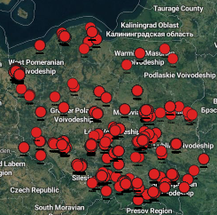

For memgraph-lab to visualise points on the map, nodes have to have properties "lat" and "lng".  

### Powiats

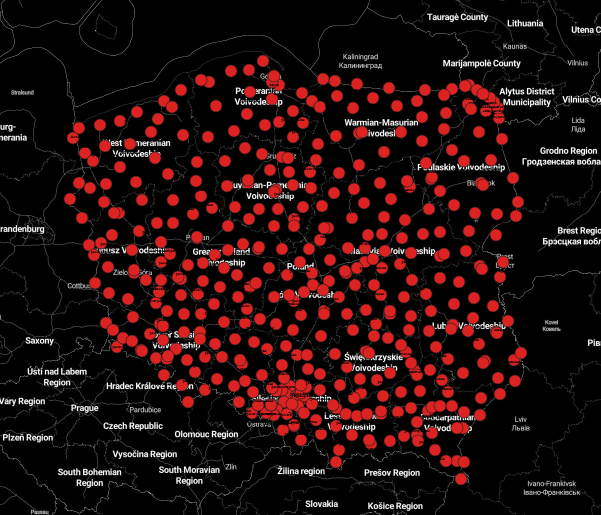

## Import report (only memgraph)
This does not include preprocessing and fragmenting dataframes
```
Import Report:
Buildings data imported in 28.34 seconds.
Cities data imported in 3.86 seconds.
Communes data imported in 1.86 seconds.
Countries data imported in 0.40 seconds.
Powiats data imported in 1.01 seconds.
Railways data imported in 1.97 seconds.
Roads data imported in 59.16 seconds.
Trees data imported in 3.81 seconds.
Voivodships data imported in 0.51 seconds.
Total time taken: 100.90 seconds.
```


## Import report (entire pipeline)
```
Import Report:
Buildings data imported in 693.86 seconds.
Cities data imported in 17.86 seconds.
Communes data imported in 7.97 seconds.
Countries data imported in 0.76 seconds.
Powiats data imported in 3.81 seconds.
Railways data imported in 7.93 seconds.
Roads data imported in 625.83 seconds.
Trees data imported in 14.44 seconds.
Voivodships data imported in 1.37 seconds.
Total time taken: 1373.82 seconds.
```

## Results
36 milion nodes - 12.5 GB

### Cities
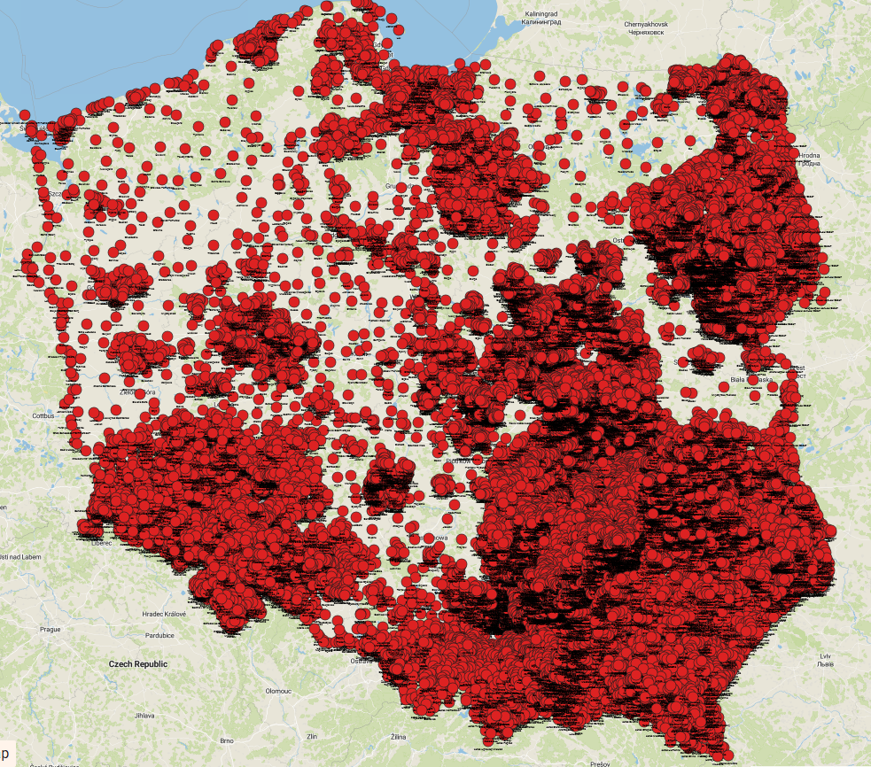

### Communes
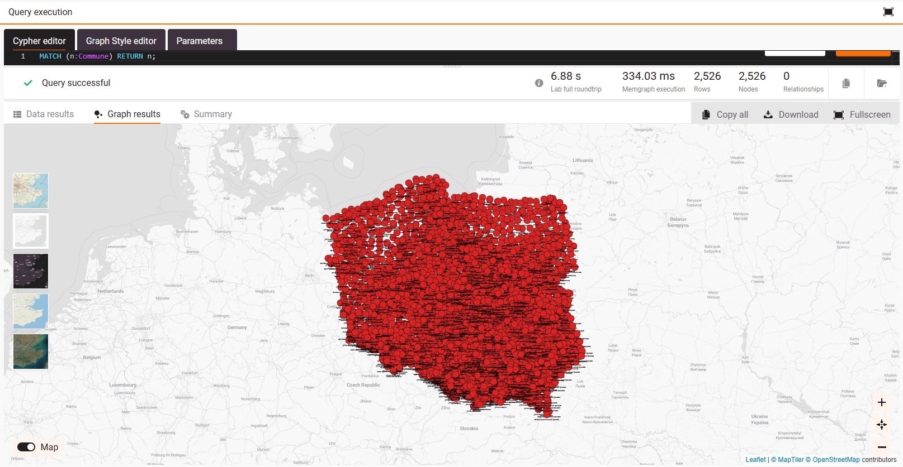

### Voivodships
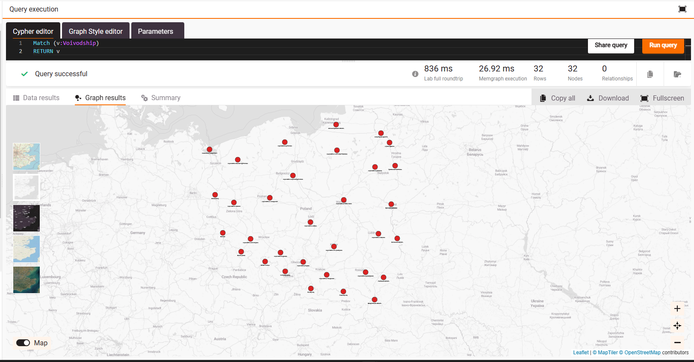

### Countries
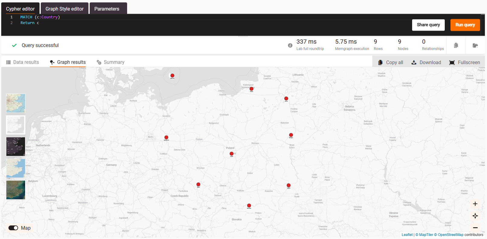

# Milestone 4: Relationship detection

## Creating Relationships with the CLI Tool
Our command-line interface (CLI) simplifies relationship creation. The process involves two main steps:
1. Ensure all required nodes are already imported into the database. If not, use the appropriate import command. For example, to import cities and communes, run: `import auto cities communes`.
2. Create a specific relationship using the cr command followed by the relationship number. For instance, to create the first relationship (Cities within commune boundaries), execute: `cr 1`. 

## Relationship Creation Performance
The following list summarizes the time taken to create various relationships, along with the resulting number of edges and their approximate size:
- Relationship 1 created in 40.95 seconds. (25,741 edges)
- Relationship 2 created in 7.86 seconds. (2,561 edges)
- Relationship 3 created in 8.72 seconds. (413 edges)
- Relationship 4 created in 3.89 seconds. (31 edges)
- Relationship 5 created in 50.69 seconds. (14,308 edges)
- Relationship 6 created in 289.14 seconds. (truncated to around 3 million, all neighbours calculate for around 10200 buidlings)
- Relationship 7 created in 22.56 seconds. (32 milion edges, 4GB)
- Relationship 8 created in 57.73 seconds. (1.3 milion edges) 
- Relationship 9 created in 173.03 seconds. (6 milion edges)
- Relationship 10 created in 162.63 seconds. (60k edges)
Total time taken: 817.19 seconds.  
As more and more swap memory must be used the performance gets worse.  

## Total memory usage
Peak memory usage was 45 GB RAM and swap  
After everything was calculated 30 GB RAM and swap  
Snapshot size is 20.80 GiB

## Database Schema Graph
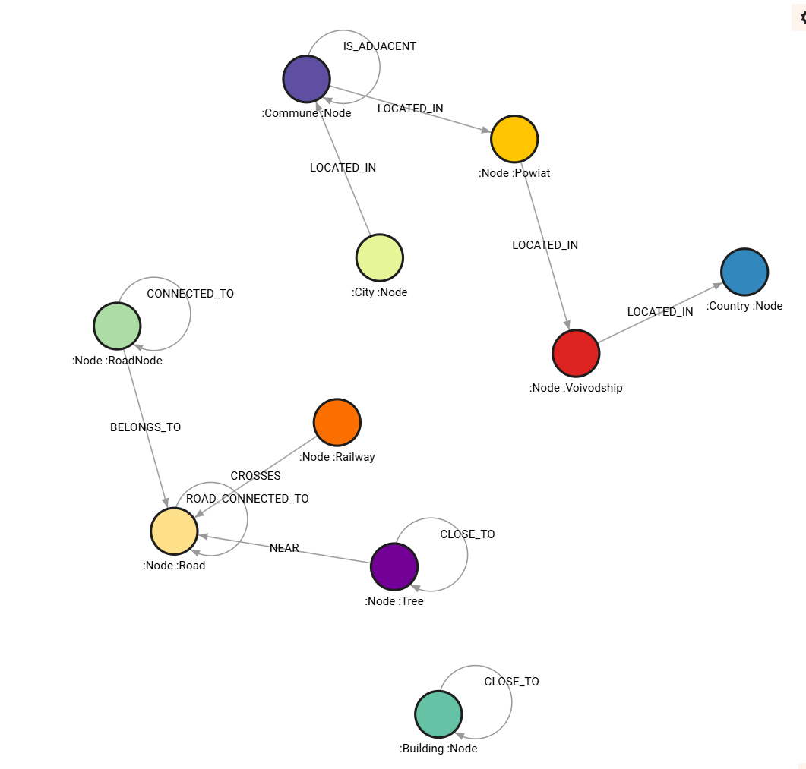

## Implementation

### Relationships 1-4
The first four relationships were implemented in a similar manner. They create "LOCATED_IN" relationship between bigger entity and smaller entity.

1. Indexing and Spatial Filtering:
We first created essential indexes (including point indexes) on relevant nodes to facilitate faster lookups.
We then optimized queries to identify candidate nodes for relationship creation. This involved shrinking the search space as much as possible.
For example, in the first relationship, we only retrieved pairs where the city center was located within the bounding box of the corresponding commune. This significantly reduced the number of unnecessary comparisons.

2. Analyzing and Optimizing Queries:
We initially used a simple query that directly matched  City and Commune nodes:
   ```cypher
      MATCH (city:City), (commune:Commune)
   ```
   However, this resulted in a Cartesian product, leading to a large number of comparisons.
   To address this, we used the EXPLAIN command to analyze the query plan and identify potential bottlenecks. Based on the analysis, we implemented a more optimized approach:
   ```cypher
   MATCH (commune:Commune) WITH commune.lower_left_corner as llc, commune.upper_right_corner as urc, commune 
   MATCH (city:City)  
   WHERE point.withinbbox(city.center, llc, urc) 
   RETURN city.id AS city_id, city.center.x AS city_x,
   ```
3. CSV for Temporary Storage and Relationship Creation

   The filtered data from the optimized query was saved to a temporary CSV file.
   This data then served as a source for creating relationships between the corresponding nodes identified in the CSV.

4. Cleanup

   Finally, we cleaned up by deleting the temporary indexes created for efficient execution.
   The first four relationships were implemented analogously. First we created necessary indexes and point indexes. Then we obtained the candidate nodes for creating relationships, ooptimiizng the query and srinking the search space as much as we can. For example, in first relationship we returned only pairs with communes and cities within bounding boxes of these communes.

### Relationship 5

The core idea is to efficiently filter commune pairs before performing computationally expensive adjacency checks. This is achieved through the following steps:

1. First we calculate the maximum diamiter (max_dia) among all communes, which at the same time is the longest possible distance between the centers of 2 communes.
2. Only pairs whose centers are within max_dia of each other are considered potential neighbors. This spatial pre-filtering drastically reduces the number of pairs that need to be checked for actual adjacency.
3. To further optimize, the query enforces a directional comparison using id(c1) < id(c2). This ensures that each commune pair is evaluated only once, preventing redundant calculations.

### Geometric Adjacency Check

A geometric check is performed using the `touches` or `overlaps` functions from a spatial library shapely. This function uses WKT representations of the commune boundaries to determine actual adjacency.

      A and B overlap if they have some but not all points in common, have the same dimension, and the intersection of the interiors of the two geometries has the same dimension as the geometries themselves.

As the result, adjacent communes are connected with the "IS_ADJACENT" relationship to each other (bidirectional relationship).

## Examples of implemented relationships to be detected
### Relationship 1 - Cities which are within commune boundaries
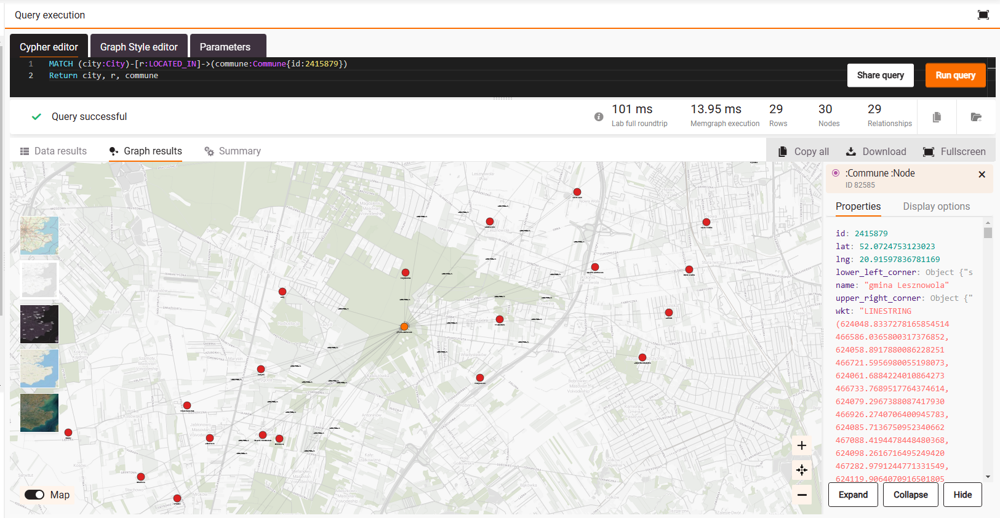

### Relationship 2 - Communes which are within powiat boundaries
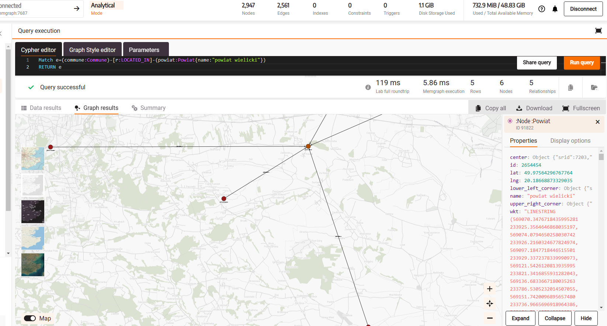

### Relationship 3 - Powiats which are within voivodship boundaries
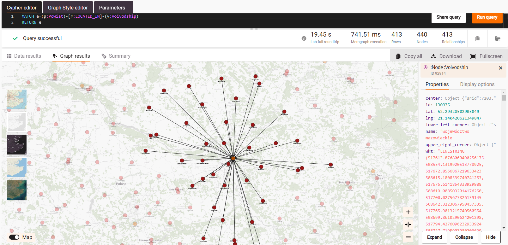

### Relationship 4 - Voivodship which are within country boundaries
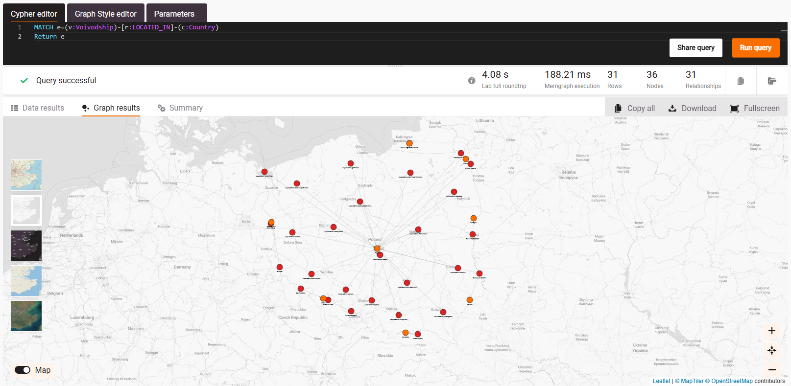

### Relationship 5 - Neighbouring (adjacent) communes
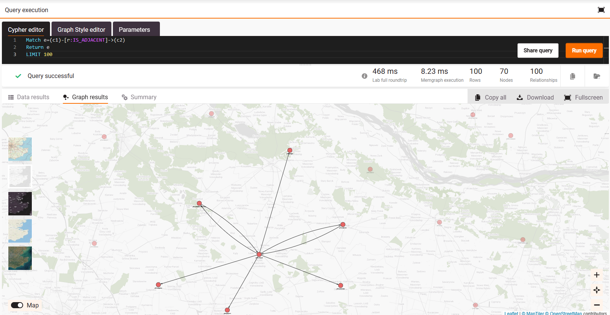

Gmina Biskupice borders with only 3 other communes, which was correctly detected by our system, and presented in the below screenshot:
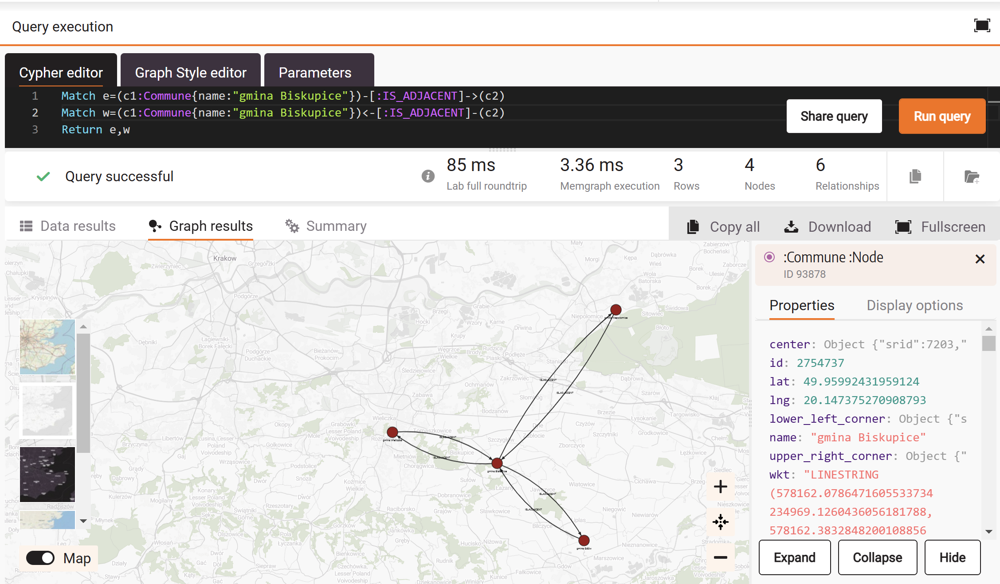
Gmina miejsko-wiejska Pisz (the Pisz urban-rural commune) borders the following communes: Rozogi, Ruciane-Nida, Mikołajki, Orzysz, Biała Piska, and also Kolno, Łyse, and Turośl in the Podlaskie Voivodeship. Which was correctly detected by our system, and presented in the below screenshot:

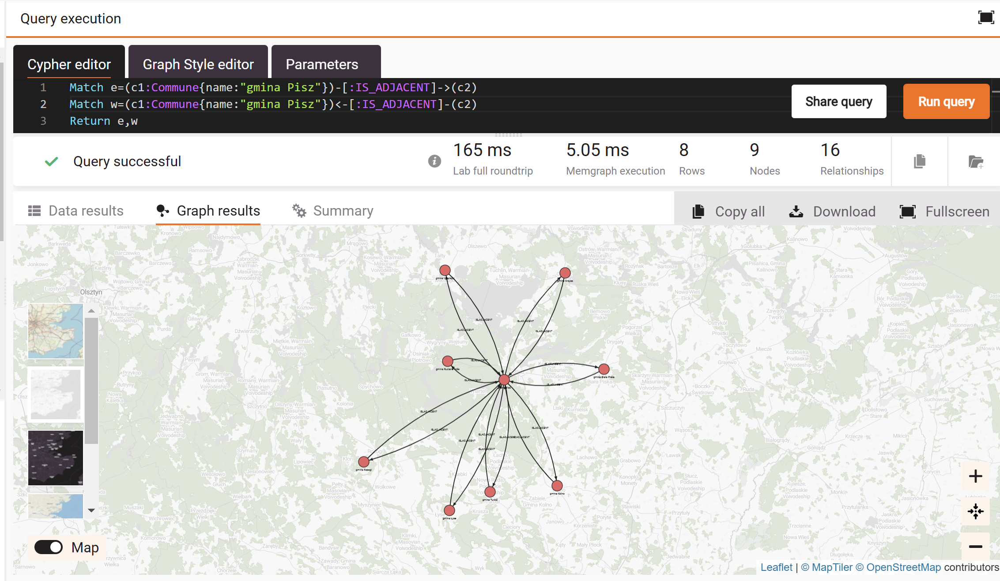

### Relationship 6 - All neighbouring buildings not further than 500 meters apart;
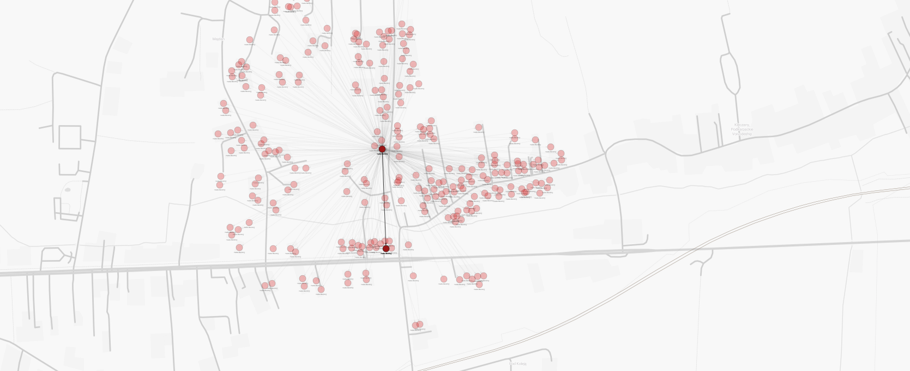  

### Relationship 7 - All neighbouring trees not further than 50 meters apart
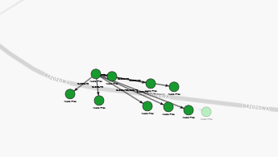

### Relationship 8 - Trees which are not further than 20 meters from a road
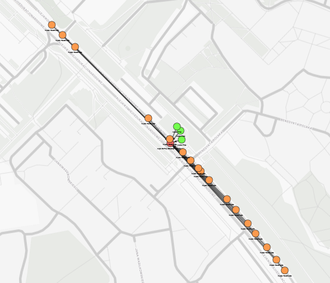

### Relationship 9 - Roads which are connected through nodes; attributes
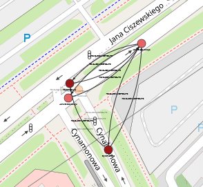
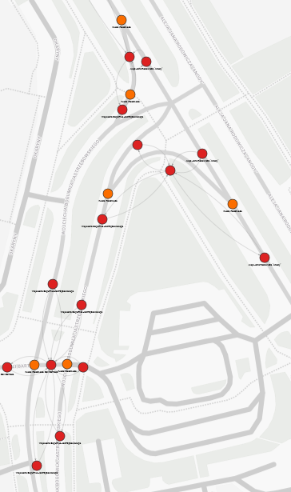

### Relationship 10 - Railways which cross roads; attributes:
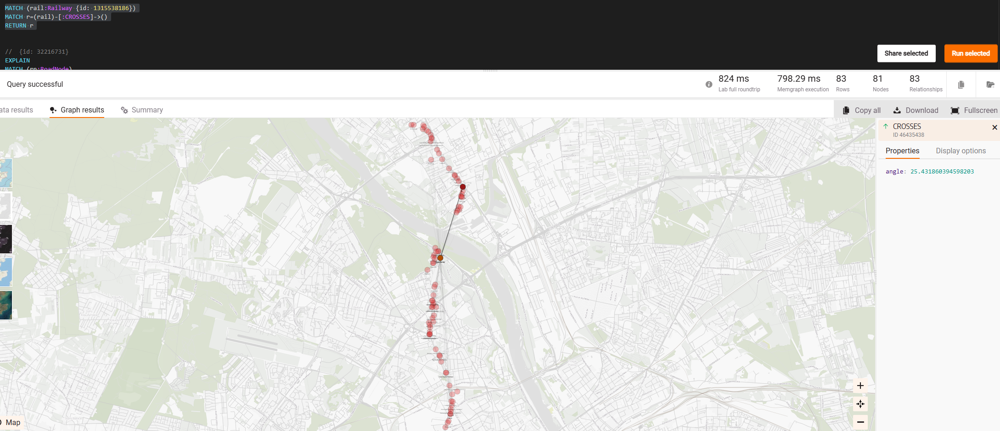


## Performance and Storage problems
### Memory Limitations
During development, we encountered numerous memory-related crashes. The solution was to increase the allocated RAM and swap for WSL2.

### On-Disk Transaction Considerations
The next issue was that on disk transactional did not work.   
While this could be revisited in the future, our primary focus during this stage was on modeling relationships.  
Possible solutions:  
- gqlalchemy (link: https://memgraph.com/blog/gqlalchemy-on-disk-storage)
- additional database for storing

### Performance Evaluation and Scalability Analysis
#### Creating buildings neighbourhood problem
We conducted a performance evaluation of relationship creation. Processing approximately 10 000 building nodes took 3 minutes and resulted in over 3 milion relationships. 
For example, the top red building in the below picture has over 300 relationships and this is a small village in the Podkarpackie voivodship.

  

#### Extrapolation to Full Dataset
Extrapolating these results to the full dataset of 17 million building nodes suggests the following:
- Processing all 17 million nodes would require an estimated 5100 minutes (85 hours), assuming a similar distribution of relationships.
- This would result in approximately 5.1 billion relationships.

##### Performance Bottlenecks
We explored several optimization strategies to improve performance, including:  
- `export_util` was checked for speed, did not work.   
- Multiple versions of parallelizations were checked, did not work.  

#### Resource Consumption:
Creating the initial 3 million relationships consumed 24.26 seconds and approximately 1GB of memory. Extrapolating this to the full dataset:
Creating 5.1 billion relationships (1,700 times more than the initial test) would require an estimated 1.7TB of memory, assuming a similar relationship distribution.  

1. A 500-meter radius around a single point (approximating a building as a point in this initial calculation) covers an area of 78.54 hectares (ha).
2. Poland has an area of approximately 311,888 square kilometers (km²), which is equivalent to 31,188,800 ha. With 17 million buildings, this translates to an average of one building per 1.8 ha, assuming a uniform distribution across the country.
3. Based on this uniform distribution, each building would, on average, have approximately 43 other buildings within its 500-meter radius (78.54 ha / 1.8 ha ≈ 43.6).
4. If we consider non-directional relationships (i.e., if building A is within 500m of building B, the relationship is only counted once), the total number of relationships would be significantly reduced. With 17 million buildings and an average of 43 relationships per building, the total number of non-directional relationships would be approximately (17,000,000 * 43) / 2 = 365,500,000 which is approximately 366 million relationships.
5. 366 mln relationships translates to over 100GB of memory.

##### Impact of Building Dimensions:
The calculation above assumes buildings are point locations. In reality, buildings have dimensions. Considering the distance between the edges of buildings further complicates the analysis and increases the potential number of relationships. This is because two buildings could be slightly further apart than 500m center to center, but still be within 500m edge to edge. This significantly increases the calculation complexity and the number of relationships.
 
#### Scalability Tests with Tree Data
##### Initial Test
Using 1 million trees and a 50-meter radius for relationship creation, we generated 32 million edges (relationships) and consumed 4GB of memory.

##### Extrapolation to 17 Million Trees (Optimal Case):

To estimate the impact of scaling to 17 million trees, we considered an optimal scenario where each additional tree is located in a separate dimension. This minimizes the number of new relationships created as the dataset grows (a highly unrealistic scenario, but useful for establishing a lower bound).

Under this optimal scenario, scaling to 17 million trees would result in:
- Estimated Edges: 544 million edges (32 million * 17).
- Estimated Memory Consumption: 68 GB of memory (4 GB * 17).

# Milestone 5: Query implementation

## Query details and visualisations 

### Query 1 - Number of cities within each commune

```json
   {
        "id": 1748161,
        "name": "gmina Przemyśl",
        "number_of_cities_within": 16
    },
    {
        "id": 1746431,
        "name": "gmina Oleszyce",
        "number_of_cities_within": 10
    },
    {
        "id": 1671683,
        "name": "gmina Warta Bolesławiecka",
        "number_of_cities_within": 10
    },
    ...
```

### Query 2 - Adjacent powiats
```json
   {
        "id": 1552758,
        "name": "powiat sztumski",
        "adjacent_powiats": [
            {
                "id": 1551638,
                "name": "powiat kwidzyński"
            },
            {
                "id": 2675470,
                "name": "powiat ostródzki"
            },
            {
                "id": 2675417,
                "name": "powiat iławski"
            },
            {
                "id": 2675409,
                "name": "powiat elbląski"
            },
            {
                "id": 1551609,
                "name": "powiat tczewski"
            },
            {
                "id": 1552789,
                "name": "powiat malborski"
            }
        ]
    },
    ...
```
### Query 3 - Adjacent voivodships

```json
   {
        "id": 223407,
        "name": "województwo kujawsko-pomorskie",
        "adjacent_voivodships": [
            {
                "id": 130971,
                "name": "województwo wielkopolskie"
            },
            {
                "id": 130975,
                "name": "województwo pomorskie"
            },
            {
                "id": 223408,
                "name": "województwo warmińsko-mazurskie"
            },
            {
                "id": 224458,
                "name": "województwo łódzkie"
            },
            {
                "id": 130935,
                "name": "województwo mazowieckie"
            }
        ]
    },
    {
        "id": 435513,
        "name": "Severovýchod",
        "adjacent_voivodships": [
            {
                "id": 224457,
                "name": "województwo dolnośląskie"
            },
            {
                "id": 435508,
                "name": "Střední Morava"
            }
        ]
    },
```
   
### Query 4 - Clusters of buildings; parameters: max distance, building type, min count

For the purpose of this query neighbourhoods were calculated for every building in the bounding box of powiat wielicki.    

There were 140 thousands of such buldings. This resulted in over 25 milion relationships.  

Following visualsation is a part of a result of running a query 4 for buildings of type "house", max distance equal to 60m, minimal cluster size of 5.  
There were 243 such clusters, amounting to 6743 nodes. It took 3.5 seconds to compute this, from which selecting buildings took 40% of the time and computing the clusters antoher 40%.  

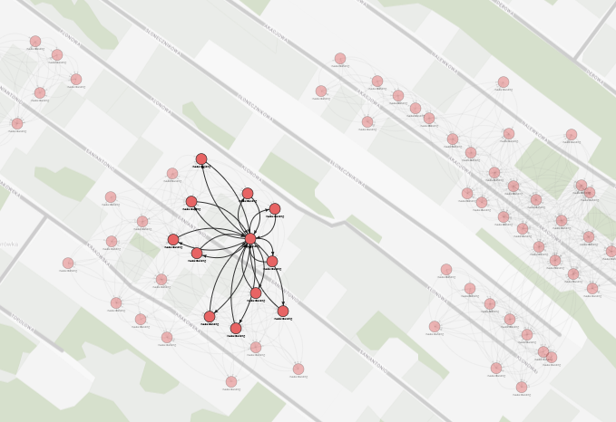

To visualize this query, run in the memgraph-lab the following query:
```CYPHER
MATCH p=(b1:Building {building:"house"})-[e:CLOSE_TO]-(b2:Building {building:"house"})
WHERE e.distance <= 60
WITH project(p) AS subgraph
CALL nxalg.strongly_connected_components(subgraph) 
YIELD components
UNWIND components as c
WITH c, subgraph
WHERE size(c) >= 5
WITH c, subgraph
CALL graph_util.connect_nodes(subgraph, c)
YIELD connections
RETURN c, connections
```

### Query 5 - Road/railway crossings; parameters: min angle, max angle

```json
   {
        "railway_id": 1316097848,
        "road_id": 705725010,
        "angle": 90.69921526002727
    },
    {
        "railway_id": 1314371126,
        "road_id": 1177650934,
        "angle": 93.78910026570347
    },
    {
        "railway_id": 1315651090,
        "road_id": 587750741,
        "angle": 92.7268952004947
    },
    {
        "railway_id": 1315651090,
        "road_id": 232223317,
        "angle": 89.1838251618756
    },
    {
        "railway_id": 1315651090,
        "road_id": 922102568,
        "angle": 97.06947863709011
    },
    {
        "railway_id": 1315651090,
        "road_id": 1229926607,
        "angle": 96.81010856956553
    },
```

### Query 6 - Roads which run parallel to railways2; parameters: to be agreed
We prepared 2 variants, strict or lazy check.
Strict check requires that all road segments are within given max_distance, and all of their segments are parallel (angles differ by maximum of max_angle) to the closest railway segment, and any segment cannot cross the railway.  
Lazy check requires that at least one road segment is within given max_distance and is parallel (angles differ by maximum of max_angle) to the closest railway segment. Road can cross the railway.  

Example roads parallel to a railway, lazy check, max_distance=200, max_angle=10 (58 roads)  
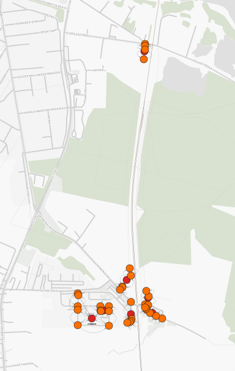

Example roads parallel to a railway, strict check, max_distance=200, max_angle=10 (17 roads)  
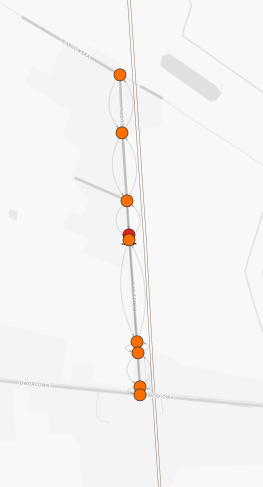
To visualize use
```CYPHER
MATCH (railway:Railway{id: 23526100})
WITH [
            238863404,
            293369614,
            213956026,
            1014623780,
            185628095,
            379126792,
            293369612,
            675724700,
            168134558,
            168134556,
            1316002479,
            178398127,
            177705443,
            737042512,
            487583054,
            279366959,
            737042513,
            29045466
    ] as ids, railway
MATCH (n:Road)
WHERE n.id IN ids
MATCH (n)<-[:BELONGS_TO]-(rn:RoadNode)
WITH COLLECT(n) + collect(rn) + [railway] as nodes
CALL graph_util.connect_nodes(nodes)
YIELD connections
RETURN nodes, connections
```

### Query 7 - Clusters of trees; parameters: max distance, min count; returned as concave hulls

Example of trees clusters with max distance of 3 and minimum cluster size of 10  
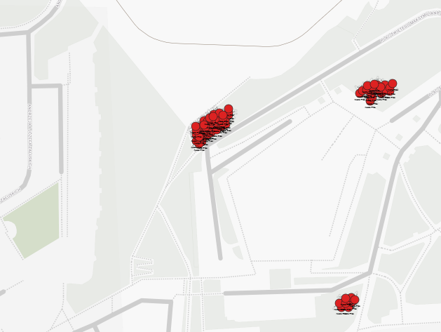  

### Query 8 - Shortest path between two indicated roads; parameters: start and end road ids
Path from Czarnowiejska to Józefa Conrada.   
It took 0.3 s to calculate.   
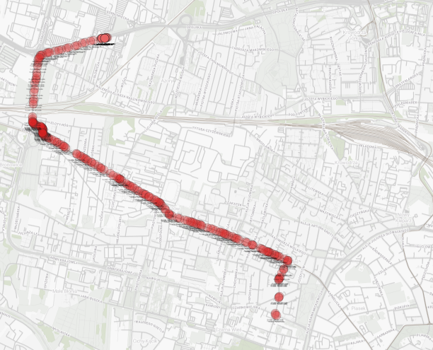  

Path from Czarnowiejska to Wawelska in Warsaw.  
It took 7 minutes to calculate  
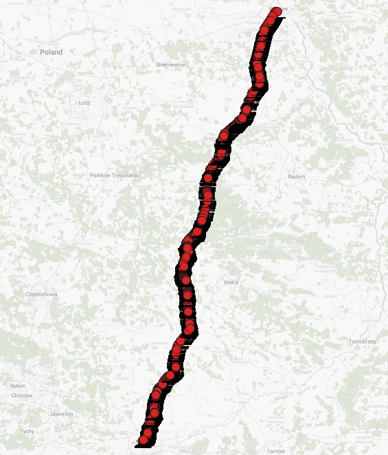  
Having to use swap lowers performance greatly. First run of "Path from Czarnowiejska to Józefa Conrada" takes 3.5 seconds, but every subsequent one takes around 250 ms, because it does not have to be loaded from swap to ram again.    
Example:    
```
> q 8 564607399 45080246
Running query 8 with parametrs start_road_id='564607399', end_road_id='45080246'
Running query: CREATE INDEX ON :Road(id)
None
Data saved to /data/query8.json
Query 8 run in 84.19 seconds.
> q 8 564607399 45080246
Running query 8 with parametrs start_road_id='564607399', end_road_id='45080246'
Running query: CREATE INDEX ON :Road(id)
None
Data saved to /data/query8.json
Query 8 run in 17.74 seconds.
```

### Query 9 - Quasi-roundabouts: find cycles consisting of one-way streets connected end-to-end;parameters: max length

At first we thought that this task meant oneway roads that have the same start and end nodes. We used the follwing query for that  
```CYPHER
MATCH (road:Road {oneway:"yes"})
WHERE road.start_node_id = road.end_node_id
MATCH (road)<-[:BELONGS_TO]-(roadNode:RoadNode{id: road.start_node_id})
CALL {
  WITH roadNode as n, inDegree(road) as max_depth
  MATCH path = (n)-[relationships:CONNECTED_TO * max_depth .. max_depth]->(n)
  RETURN path
  LIMIT 1
}
WITH nodes(path) as cycle, road
WHERE size(cycle) <= 20
RETURN extract(n IN cycle | n.id) as node_ids, road.id as road_id, road.name as road_name
```
Example roundabout  
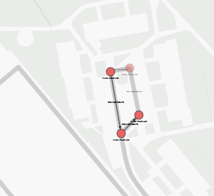

But the real quasi roundabouts were diffcult to calculate  
We tried multiple functions provided by memgraph:  
- nxalg.all_simple_paths
- nxalg.simple_cycles
- nxalg.find_cycles
- manually find cycles
But they were no good.  

Soltuion was to use networkx in python on graph extracted from memgraph with a query.  

Example roundabouts  
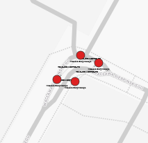  
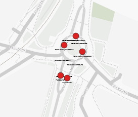  

To view these roundabouts, use
```CYPHER
WITH [
            1087085920,
            1087085925,
            1087085921,
            1087085928,
            1087085926
    ] as ids
MATCH (n:Road)
WHERE n.id IN ids
WITH COLLECT(n) as nodes
CALL graph_util.connect_nodes(nodes)
YIELD connections
UNWIND connections as connection
WITH connection, nodes
WHERE connection.part = "end"
WITH COLLECT(connection) as c, nodes
RETURN nodes, c
```

### Query 10 - Roads with trees near them; parameters: min count, max distance

Example roads and trees within 15 meters  
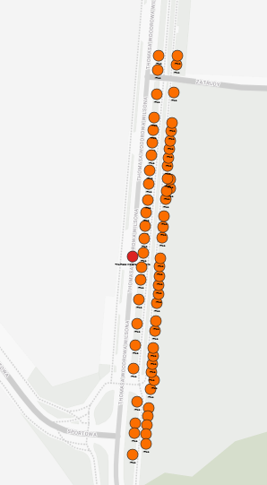  

### Running times
Query 1 run in 1.38 seconds.  
Query 2 run in 1.03 seconds.  
Query 3 run in 0.98 seconds.  
Query 4 run in 88.76 seconds.  
Query 5 run in 1.88 seconds.  
Query 6 run in 151.45 seconds.  
Query 7 run in 86.42 seconds.  
Query 8 run in 5.19 seconds.  
Query 9 run in 165.83 seconds.  
Query 10 run in 6.59 seconds.  
Total time taken: 509.51 seconds.  

# Final statistics  
vertex_count 35,992,818  
edge_count 134,549,916	   
average_degree 7.476   

Data import report:  
Roads data imported in 539.32 seconds.  
Buildings data imported in 693.21 seconds.  
Cities data imported in 18.64 seconds.  
Communes data imported in 7.90 seconds.  
Countries data imported in 0.77 seconds.  
Powiats data imported in 3.76 seconds.  
Railways data imported in 7.90 seconds.  
Trees data imported in 14.39 seconds.  
Voivodships data imported in 1.34 seconds.  
Total time taken: 1287.24 seconds.  

Relationship creation report:  
Relationship 1 created in 76.08 seconds.  
Relationship 2 created in 9.92 seconds.  
Relationship 3 created in 8.82 seconds.  
Relationship 4 created in 3.97 seconds.  
Relationship 5 created in 46.87 seconds.  
Relationship 6 created in 1513.88 seconds. (only Powiat Wielicki bounding box (includes half of Cracow) 23 M edges)  
Relationship 7 created in 27.98 seconds.  
Relationship 8 created in 54.51 seconds.  
Relationship 9 created in 148.55 seconds.  
Relationship 10 created in 167.63 seconds.  
Total time taken: 2058.22 seconds.  


First run   
Query running report:  
Query 1 run in 2.06 seconds.  
Query 2 run in 1.38 seconds.  
Query 3 run in 1.03 seconds.  
Query 4 run in 102.21 seconds.  
Query 5 run in 1.47 seconds.  
Query 6 run in 161.85 seconds.  
Query 7 run in 90.03 seconds.  
Query 8 run in 5.16 seconds.  
Query 9 run in 163.84 seconds.  
Query 10 run in 5.62 seconds.  
Total time taken: 534.65 seconds.  

It took approximately 65 minutes from start to obtaining all query results.  

Second run  
Query running report:  
Query 1 run in 0.88 seconds.  
Query 2 run in 0.78 seconds.  
Query 3 run in 0.72 seconds.  
Query 4 run in 60.12 seconds.  
Query 5 run in 0.55 seconds.  
Query 6 run in 150.70 seconds.  
Query 7 run in 33.43 seconds.  
Query 8 run in 0.99 seconds.  
Query 9 run in 153.68 seconds.  
Query 10 run in 3.29 seconds.  
Total time taken: 405.17 seconds.  

# How to run everything
We recommend having at least 50 GBs of RAM + Swap memory and adding this line into file /etc/sysctl.conf
```
vm.max_map_count = 262144  
```

Copy every csv needed to directory "data", located in the same directory as this repository.  
Open 2 terminals.  
In the first one run:  
```bash
docker-compose up --build
```
In the second one run:  
```bash
docker compose run --rm manager
```
In the second terminal run:
```
import auto all
```  
```
cr all 
```  
```
q all
```  
It's done!  Query results should appear in the "data" directory.  
For more details run:  
```
help
```  
# Guide on running visualization
In one terminal run the docker compose to set up the environment:
```
docker-compose up --build
```
Now you can open the frontend under the url specified in logs, for us it was `http://localhost:3000`. You have to login to the database with the following credentials:
- username: testuser123
- password: t123

In the 2nd terminal run manager container:
```
docker compose run --rm manager
```
**All commands you want to run on via CLI tool has to be run in this 2nd terminal.**

## Test scenario 1: Adjacent communes to the biggest commune in Poland: Gmina Pisz
1. Run environment in the first terminal
2. Open frontend and log in into database
3. To make sure you are working on the plain database and to avoid node duplications, clear everything by running the query:
   ```
   MATCH (n) DETACH DELETE n;
   ```
   The result should be as follows:
   
4. Run manager container in the 2nd terminal and import communes using CLI :
   ```
   import auto communes
   ```
   You know that it is finished when it outputs the total execution time.
5. It should result in creating commune nodes:
   
6. Run creating 5th relationship in the CLI (2nd terminal):
   ```
   cr 5
   ```
7. In the frontend (Memgraph lab) run the following query to obtain all adjacent communes to the Pisz commune:
   ```cypher
   Match e=(c1:Commune{name:"gmina Pisz"})-[:IS_ADJACENT]->(c2)
   Match w=(c1:Commune{name:"gmina Pisz"})<-[:IS_ADJACENT]-(c2)
   Return e,w
   ```
8. You can also check all communes adjacent to Kraków commune:
   ```cypher
   Match e=(c1:Commune{name:"Kraków"})-[:IS_ADJACENT]->(c2)
   Match w=(c1:Commune{name:"Kraków"})<-[:IS_ADJACENT]-(c2)
   Return e,w
   ```
   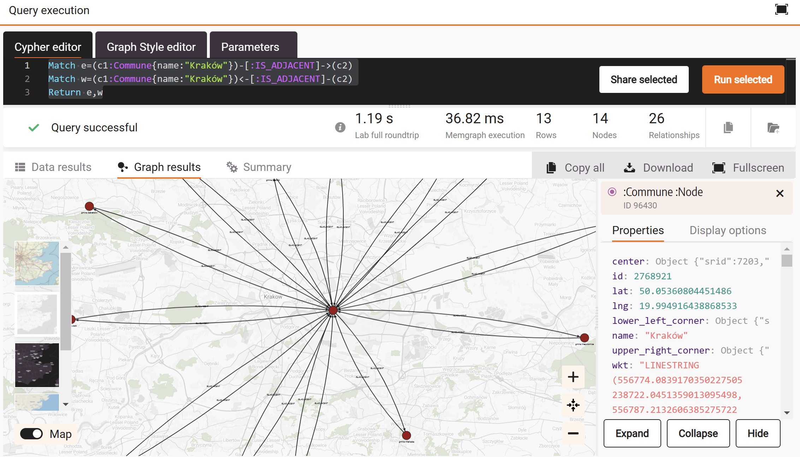

## Test scenario 2: Cities inside gmina Jasiniec
1. Run environment in the first terminal
2. Open frontend and log in into database
3. To make sure you are working on the plain database and to avoid node duplications, clear everything by running the query:
   ```
   MATCH (n) DETACH DELETE n;
   ```
   The result should be as follows:
   
4. Run manager container in the 2nd terminal and import communes using CLI :
   ```
   import auto communes cities
   ```
   You know that it is finished when it outputs the total execution time.
5. Run creating 1st relationship in the CLI (2nd terminal):
   ```
   cr 1
   ```
6. In the frontend (Memgraph lab) run the following query to obtain all cities within "gmina Jasiniec"
   ```cypher
   Match e=(city:City)-[r:LOCATED_IN]->(commune:Commune{name:"gmina Jasieniec"})
   return e
   ```
   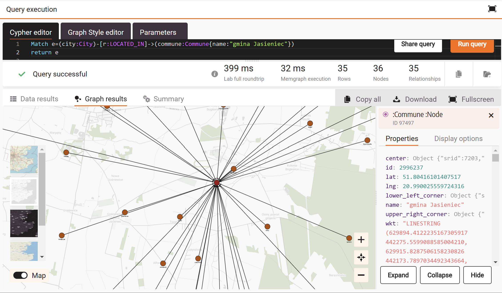

## Test scenario 3: Commune in Powiat in Voivodship
```cypher
Match e=(c1:Commune{name:"gmina Biskupice"})-[:LOCATED_IN]->(p:Powiat)-[:LOCATED_IN]->(v:Voivodship)-[:LOCATED_IN]->(c2:Country)
Return e
```

# Computer specifications

Cpu:	Intel(R) Core(TM) i5-14600KF  
Memory:  32.0 GB 6800 MT/s  
Hard drive: Lexar SSD NM790 2TB  
  


- Milestone 5 - Paulina Gacek, Jakub Hulek

# Resources
1. https://memgraph.com/docs/data-migration/best-practices  
