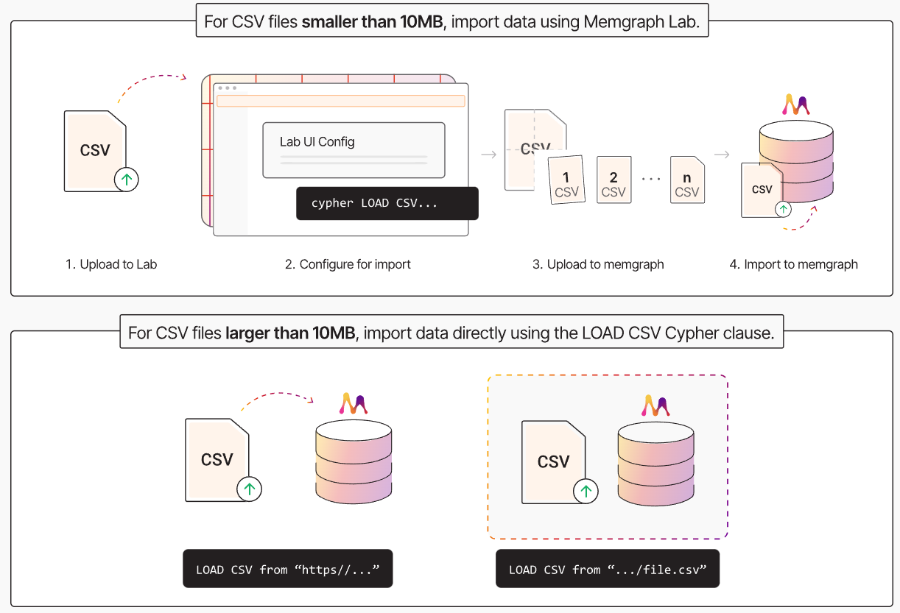

# Advanced Database Systems
Paulina Gacek, Jakub Hulek

## Main Technology
Memgraph [link](https://memgraph.com/)

According to Memgraph documentation, nodes are stored in a skip list, a dynamic data structure that organizes nodes by their internal IDs.

## Additional Technologies
Python with Geopandas and Neo4j Libraries

## Architecture Overview

Memgraph provides Docker images containing the database and a GUI system for interacting with the database.   
We will combine this with our own custom Docker container that will manage the database and implement a CLI tool for querying the database.  
These containers will be managed with Docker Compose.  

**Summarized Containers:**  
1. **Custom Manager** Container
2. Memgraph Container (Database and Memgraph's Algorithms)  
3. Memgraph Frontend (Optional, for Visualizations)  

## Installation 

### Requirements
Docker with Docker Compose installed on the host OS

### Deployment instructions

```bash
docker compose up --build
```

Recommended adding this link into file /etc/sysctl.conf
```
vm.max_map_count = 262144  
```

## General Data Flow
Upon startup, the **Manager** container will import data from CSV files present in the project's directory. This process will be conducted using Python with Neo4j.  
The **Manager** will implement and provide a CLI tool for querying the database. If Memgraph is unable to fully process a query, we will use Geopandas to patch any gaps.  


 
### Parallelism Detection
Two roads are considered parallel if and only if there exists one segment from each road that is parallel to one another.  
Two road segments are considered parallel if and only if:  
1. The minimal distance between the two ending points of the two segments is smaller than $x$.  
2. The angle between the two vectors describing the segments is smaller than $\alpha$.  

$x$ and $\alpha$ are parameters of query number 6.  


## Geometry storage
### Point indexes
According to the [documentation on point indexes](https://memgraph.com/docs/fundamentals/indexes#point-index) :
```
Point index can be utilized for more performant spatial queries which use WHERE point.distance() or WHERE point.withinbbox().
```
### Point data type
According to the [documentation on point data type](https://memgraph.com/docs/fundamentals/data-types#:~:text=client%2Dside%20results.-,Point,-Point%20is%20a) :
```
Point is a spatial data type consisting of 2D or 3D locations in the Cartesian or WGS84 system. The coordinates of the location are stored as a 64-bit Float numbers. Each point type has an associated coordinate reference system (CRS) and a spatial reference identifier (SRID). Points can be created with the point function. For fast queries, points can leverage the point index.
```

### Usage examples
```cypher
MATCH (n) DELETE n;
CREATE (l:City {name:'London', geometry:point({longitude: 51.51, latitude: -0.12})});
CREATE (l:City {name:'Zagreb', geometry:point({longitude: 45.82, latitude: 15.97})});  
  
MATCH (c1:City),(c2:City)
RETURN c1.name, c2.name, point.distance(c1.geometry, c2.geometry) AS result;

MATCH (n) DELETE n;
CREATE (l:City {name:'London', geometry:point({x:3622779.924618, y:3200649.292915})});
CREATE (l:City {name:'Zagreb', geometry:point({x:4788657.089249, y:2542917.922569})});
MATCH (c1:City),(c2:City)
RETURN c1.name, c2.name, point.distance(c1.geometry, c2.geometry) AS result;

MATCH (n) DELETE n;
CREATE (l:City {name:'London', geometry:[point({x:3622779.924618, y:3200649.292915}), point({x:3622779.924618, y:3200649.292915})]});
MATCH (n) RETURN n.geometry;
```
**Notes:**
- Minimal geospatial capabilities  
- Geometry point as point type property  
- Complex points as list of points  

## Importing data
- 17 424 648 - number of buildings  
- 14 698 410 - number of road nodes  
- 2 588 734 - number of roads  
- 1 121 912 - number of trees  
- 130 389 - number of railways   
- Others negligible  
- Totaling around 36 milion nodes  
- Guessing their will be 100-200 milion relationships
  
*Memgraph page suggests that they can create 1 million nodes/relatioship per second assuming optimized import.*  
### Modelling 
- building - nodes  
- cities - nodes  
- communes - nodes  
- countries - nodes  
- powiats - nodes  
- railways - nodes connected with relationships  
- roads - separted into multiple nodes connected with relationships to each other + relationship to road metadata  
- trees - nodes  
- voivodships - nodes    
 
**Example from memgraph:**
```python
target_nodes_directory = Path(__file__).parents[3].joinpath(f"datasets/graph500/{size}/csv_node_chunks")
for file in target_nodes_directory.glob("*.csv"):
    subprocess.run(["docker", "cp", str(file), f"memgraph:/usr/lib/memgraph/{file.name}"], check=True)
 
queries = []
for file in target_nodes_directory.glob("*.csv"):
    queries.append(f"LOAD CSV FROM '/usr/lib/memgraph/{file.name}' WITH HEADER AS row CREATE (n:Node {{id: row.id}})")
```

## Modelling capabilites
1. Cities which are within commune boundaries 
   - precomputed with geopandas, 
   - city - commune relationship
2. Communes which are within powiat boundaries 
   - precomputed with geopandas, 
   - commune - powiat relationship
3. Powiats which are within voivodship boundaries 
   - precomputed with geopandas, 
   - powiat - voivodship relationship
4. Voivodship which are within country boundaries 
   - precomputed with geopandas, 
   - voivodship - country relationship
5. Neighbouring (adjacent) communes 
   - precomputed with geopandas, 
   - commune - commune relationship
6. All neighbouring buildings not further than 500 meters apart; 
   - attributes: distance(meters) 
   - center of a building precomputed with geopandas, then relationship either precomputed or used memgrpahs point index for faster querying
7. All neighbouring trees not further than 50 meters apart; 
   - attributes: distance (meters) 
   - relationship either precomputed or used memgrpahs point index for faster querying
8. Trees which are not further than 20 meters from a road 
   - precomputed with geopandas, 
   - tree - road relationship 
9.  Roads which are connected through nodes; 
    - attributes: connecting node identifier, which part of one road is connected to the other road (start, mid, end)
    - precomputed with geopandas, 
    - road - road relationship
10. Railways which cross roads; 
    - attributes: angle 
    - precomputed with geopandas, 
    - railway - road relationship


## Resources
1. https://memgraph.com/docs/data-migration/best-practices  
